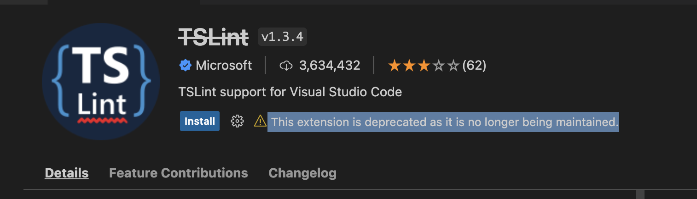

ESLint 는 타입스크립트를 작성할 때 타입 문제는 없는지, 컨벤션과 같은 규칙은 잘 지켰는지 검사를 해준다.

ESLint 만 있다면 프로젝트 컨벤션을 확인하지 않더라도 높은 퀄리티를 보여줄 수 있다.

## 문제점

현재 VS Code Extension 에 ESLint 를 보면 다음과 같이 나오고 있다.

원인, 해결 방안을 파악한다.

## 원인

아래 링크를 참고해서 원인과 해결 방안을 찾아야 한다.
근데 출근해야해서 다음에 함

- https://github.com/microsoft/vscode-discussions/discussions/1
