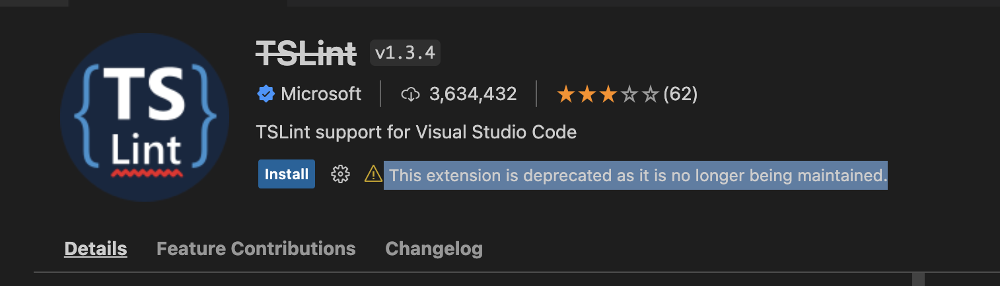

TSLint 는 타입스크립트를 작성할 때 타입 문제는 없는지, 컨벤션과 같은 규칙은 잘 지켰는지 검사를 해준다.

TSLint 만 있다면 프로젝트 컨벤션을 확인하지 않더라도 높은 퀄리티를 보여줄 수 있다.

## 문제점

현재 VS Code Extension 에 TSLint 를 보면 다음과 같이 나오고 있다.



원인, 해결 방안을 파악한다.

## 원인

```
typescript-eslint enables ESLint to run on TypeScript code. It brings in the best of both tools to help you write the best JavaScript or TypeScript code you possibly can.

ESLint and TypeScript represent code differently internally. ESLint's default JavaScript parser cannot natively read in TypeScript-specific syntax and its rules don't natively have access to TypeScript's type information.

typescript-eslint:
allows ESLint to parse TypeScript syntax
creates a set of tools for ESLint rules to be able to use TypeScript's type information
provides a large list of lint rules that are specific to TypeScript and/or use that type information
```

## 대안

tsconfig 를 작성하고 eslint 를 사용하면 된다.
