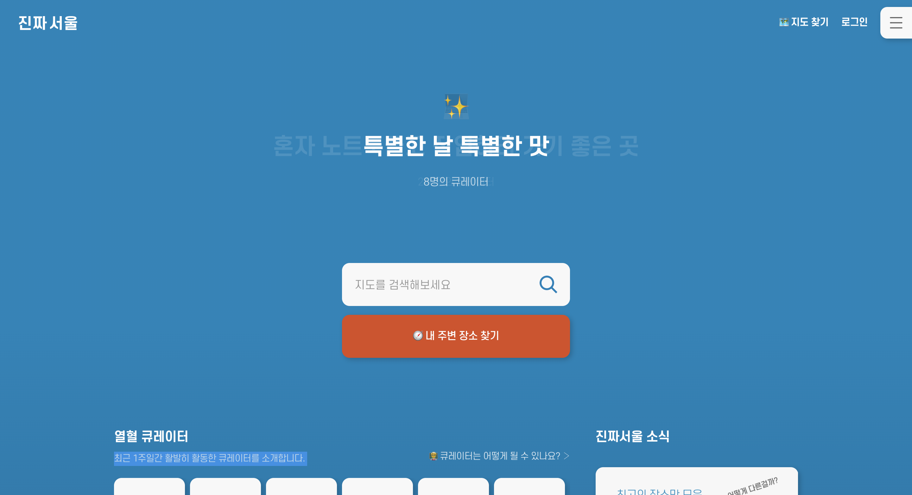
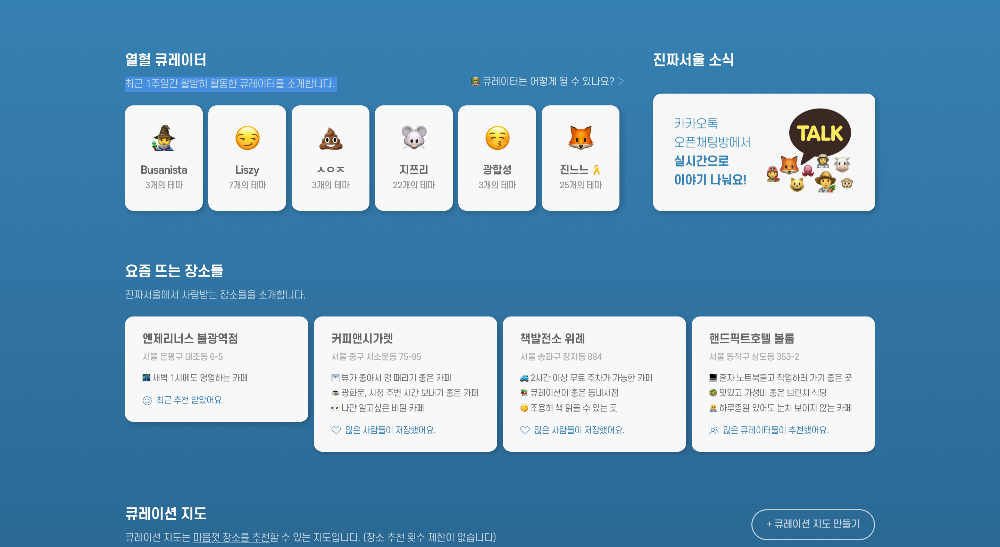
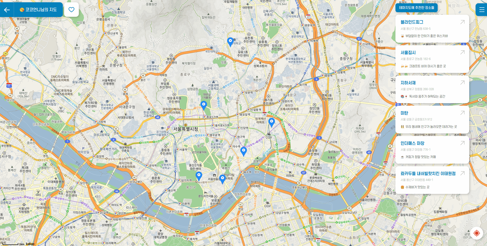
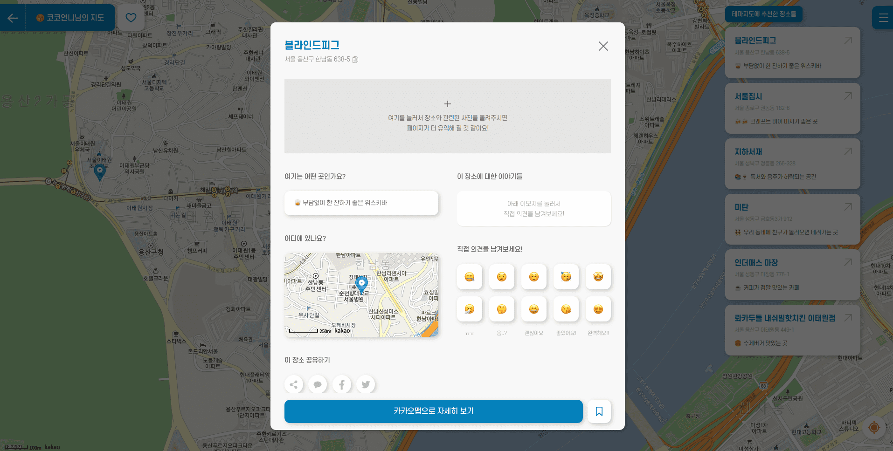
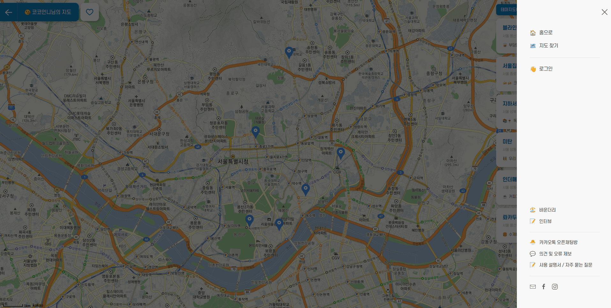
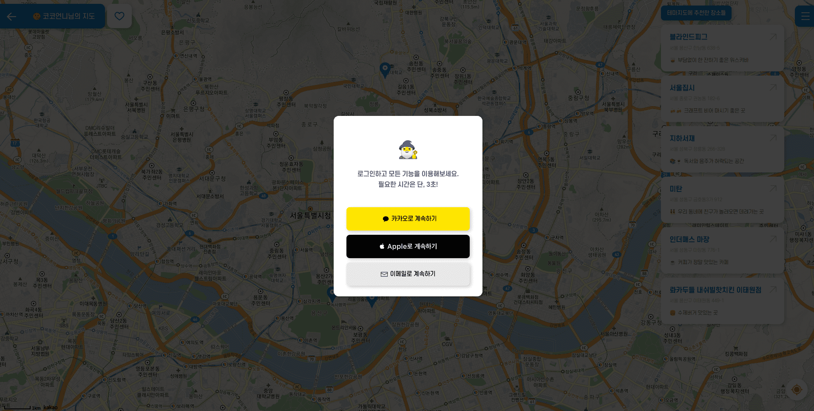
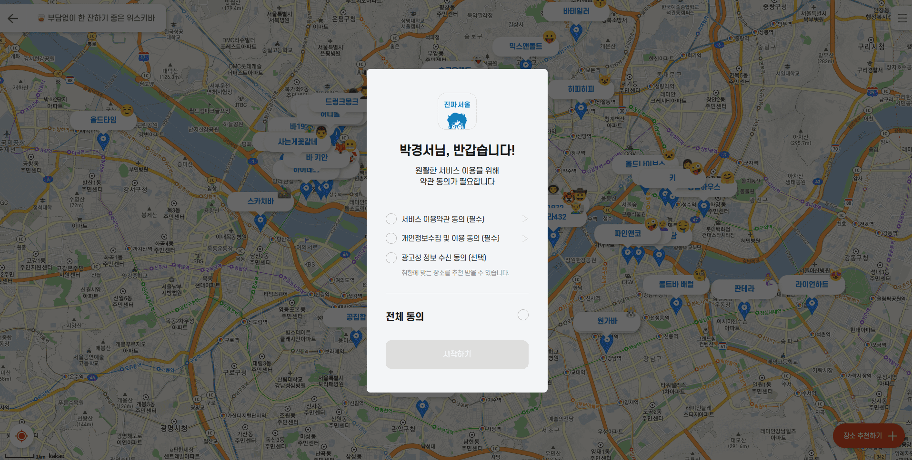
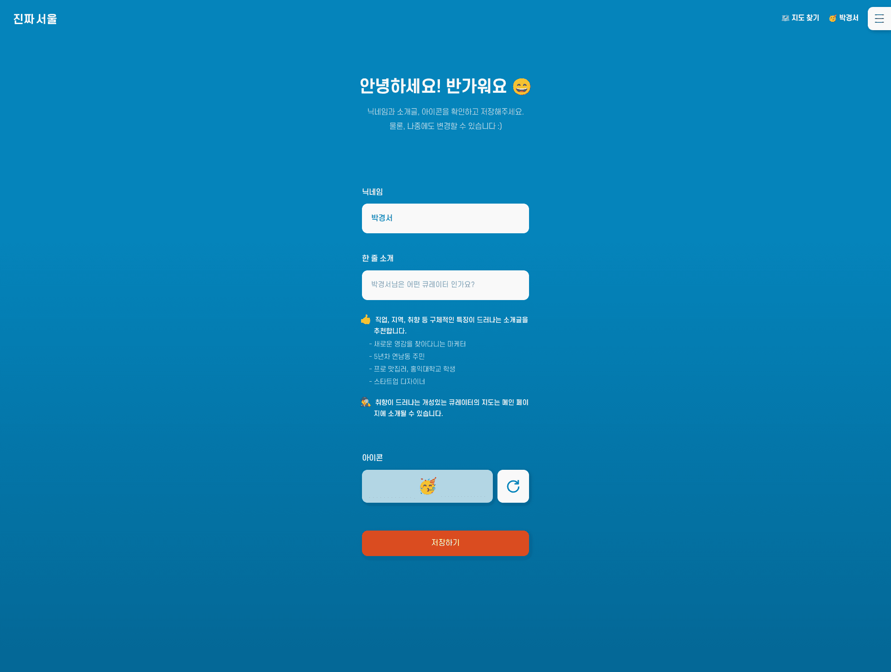
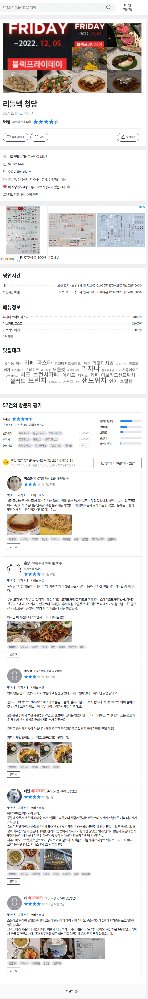

날짜 : 2022. 11. 29 (화)
시간 : 오후 7시 ~ 오후 10시 (3시간)
담당 : 박경서, 김지홍

---

# 벤치마킹

벤치마킹을 통해 어느 UI 가 필요한지, 컴포넌트는 어떻게 배치할 것인지 구상한다.

---

## 진짜 서울

메인 화면은 아래 이미지를 2분할 한다.

지도에 고속도로 휴게소 정보를 보여준다.

모달에 고속도에 대한 정볼르 간략히 보여준다.

사이드 메뉴에 적절한 항목을 추가한다.

모달을 이용해 로그인/로그아웃을 구현한다.

회원가입을 마치면, 약관 동의를 받는다. 소셜 로그인을 사용하지 않을 경우 메일 인증을 받아야 한다.

로그인을 하면 MyPage 에서 사용자 정보를 수정할 수 있다.

---

## 다이닝 서울

리뷰에 대한 상세 페이지는 다이닝 서울을 참고한다.

---

## 기술 이슈

- 로그인은 어떻게 할 것인가?
- 리뷰 등록/수정은 어떻게 할 것인가?
- 휴게소 정보 -> 식당 정보 -> 식당에 대한 리뷰 는 어떻게 관리할 것인가?
