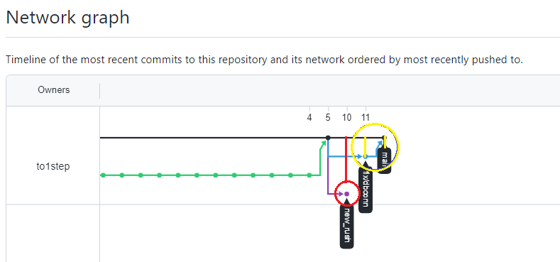
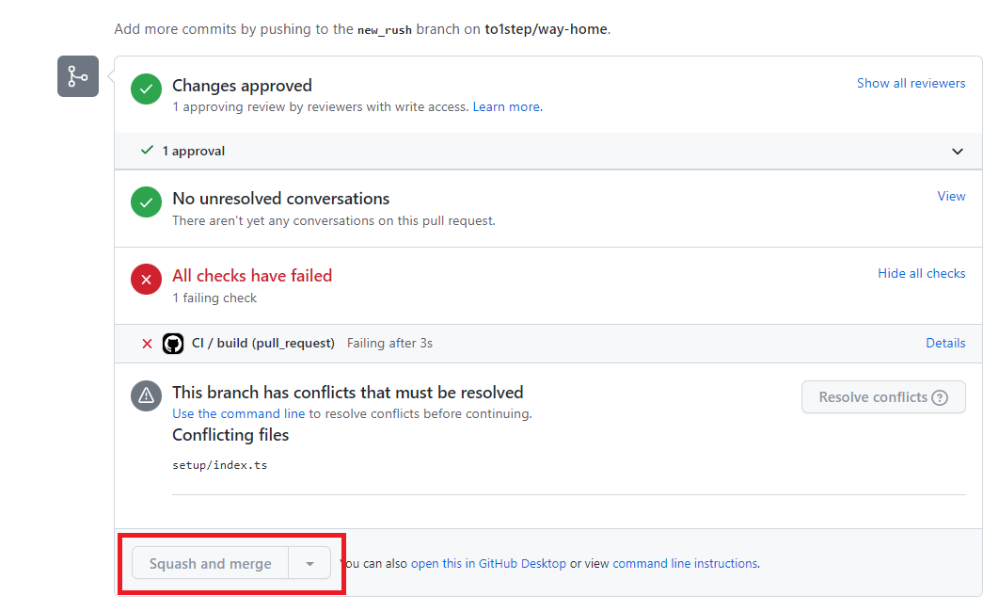

# 요약

rush 를 이용하여 모노레포 아키텍처를 투입

---

## 모노레포란?

모노레포란 두 개 이상의 프로젝트가 동일한 저장소에 저장되는 소프트웨어 개발 전략이다.

모노레포의 장점
 - 개발 초, 단순한 아키텍처 구조로 개발이 용이하다.
 - 하나의 환경에서 개발을 진행하기에, 개발 환경 세팅이 복잡하지 않다. 
 - 코드의 재사용성이 증가하고, 확장성이 쉬워진다. 
 - 비교적 쉽게 고가용성 서버 환경을 만들 수 있다.
 - End-to-End 테스트가 용이하다.(실제 사용자 환경에서 테스트 하는 것)

모노레포의 단점
 - 프로젝트 규모가 커질 때 마다 빌드와 배포 시간이 증가한다. 
 - 조금의 수정이 있더라도, 전체를 빌드하고 배포해야 한다. 
 - 규모가 커지면 개발자가 전체의 코드를 이해해야 하기 때문에, 유지보수가 어렵다.
 - 하나의 에러가 발생할 경우, 전체 서비스에 장애를 끼친다.
    - A, B 프로젝트 중 A 에만 변경사항이 있어 A 만 배포했다면 B는 장애를 받지 않는다. 
 - 새로운 기술을 도입하기가 어렵다.
 
역시 자세한 설명은 NAVER Corp 의 D2 가 최고다.

[모던 프론트엔드 프로젝트 구성 기법 - 모노레포 개념 편](https://d2.naver.com/helloworld/0923884)

---

## MAS(Microservices Architecture) 란 

최근 몇년 전 MSA 열풍이 심하게 불었다. 

그 배경에는 넷플릭스가 있는데 삼성SMS 에서 작성한 글을 읽으면 좋다. 

MSA란 모노레포와 반대로 하나의 저장소에 하나의 기능을 또는 하나의 프로젝트가 있다는 것을 컨셉으로 가지고 있다. 

마틴파울러의 MSA 에 대한 정의는 아래와 같다. 
> the microservice architectural style is an approach to developing a single application as a suite of small services, each running in its own process and communicating with lightweight mechanisms, often an HTTP resource API. 
These services are built around business capabilities and independently deployable by fully automated deployment machinery.

스스로 돌아갈 수 있는 독립 서비스라고 한다.

MSA의 장점 
 - 서비스가 분리되어 배포되어 있기 때문에 배포 시 전체 서비스의 중단이 없다. 
 - 하나의 저장소에 소수 개발자가 참여하니 자율성이 보장된다. 
 - 클라우드 사용에 적합하다. (쿠버네티스...)
 - 하나의 서비스에 장애가 발생할 경우 전체 서비스로 확장될 가능성이 적다. (카카오 IDC에 화재가 발생했을 때 서비스가 하나씩 복구되었다.)
 - 저장소에 따라 팀이 분리되었기 때문에 전체 코드의 이해가 증가하므로 유지보수가 용이하다.
 - 새로운 기술을 도입하기 좋다. 

MSA의 단점
 - 서비스간 통신을 주고 받기 때문에 네트워크 비용이 발생한다.
 - 서비스간 통신을 주고 받기 때문에 이벤트 처리 시간이 증가한다.
 - 데이터가 분리되어 있기 때문에 관리하기가 어렵다. 
 - 각 기능별로 단위 테스트는 쉽지만, End-to-End 테스트는 까다롭다.
 - 서비스가 분리되어 있으므로 DB 에 대한 트랜젝션이 까다롭다. (뭐 잘못하면 DB 락)
 - 아키텍처 자체가 복잡하기 때문에 개발 및 관리 비용이 증가한다.

[넷플릭스로 알아보는 MSA](https://www.samsungsds.com/kr/insights/msa_and_netflix.html)

---

## 우리 프로젝트에 도입된 모노레포

rush 를 사용해 패키지 재사용이 가능해졌다. 

모노레포를 도입함으로서 장점을 최대한 활용하고, 단점을 최소화 해야한다

그러기 위해서는 Rush 를 제대로 이해하고, 잘 된 레퍼런스를 적극 활용해야 한다.

> 모노레포의 장점
 - 개발 초, 단순한 아키텍처 구조로 개발이 용이하다.
 - 하나의 환경에서 개발을 진행하기에, 개발 환경 세팅이 복잡하지 않다. 
 - **코드의 재사용성이 증가하고, 확장성이 쉬워진다.** 
 - **비교적 쉽게 고가용성 서버 환경을 만들 수 있다.**
 - End-to-End 테스트가 용이하다.(실제 사용자 환경에서 테스트 하는 것)

> 모노레포의 단점
 - 프로젝트 규모가 커질 때 마다 빌드와 배포 시간이 증가한다. 
 - 조금의 수정이 있더라도, 전체를 빌드하고 배포해야 한다. 
 - 규모가 커지면 개발자가 전체의 코드를 이해해야 하기 때문에, 유지보수가 어렵다.
 - 하나의 에러가 발생할 경우, 전체 서비스에 장애를 끼친다.
    - A, B 프로젝트 중 A 에만 변경사항이 있어 A 만 배포했다면 B는 장애를 받지 않는다. 
 - 새로운 기술을 도입하기가 어렵다.

 ## 모노레포 툴
 
 뭐가 있는지 리뷰 정도만 하고 MS 에서 만든 `Rush` 를 알아보자.
 - Yarn Workspaces: 루트 package.json 파일에서 설정한 하위 폴더에 있는 여러 package.json 파일에 있는 종속성을 한 번에 설치할 수 있게 해줍니다.
 - Bit: 모놀리스(Monolith) 환경에서 컴포넌트 기반 어플리케이션을 개발을 가능하게 해줍니다.
 - Nx: Nx는 프로젝트 구조를 특정 구조를 강제하며 라이브러리별 best practice가 캡슐화된 plugin들을 사용하여 개발자 경험을 올리고 모노레포에서 필요한 기능들을 제공해줍니다.
 - Rush: 마이크로소프트에서 만든 웹을 위한 확장 가능한 모노레포 관리 툴입니다.
 - Lerna: 자바스크립트 프로젝트들을 여러 패키지로 관리하기 위한 도구로 단일 저장소에서 여러 npm 패키지를 관리하는 도구입니다.
 - Lerna + Yarn Workspace: Lerna와 Yarn Workspace의 서로의 단점을 보안하고 장점을 사용하기 위해 사용됩니다.
 - Bazel: 구글에서 만든 다양한 언어 다양한 플랫폼에서 사용되는 모노레포 관리 툴입니다.
 - Buck: 페이스북에서 만든 빌드 시스템으로 다양한 언어 다양한 플랫폼을 지원합니다. 

---

## Rush 란?

Rush 는 한번의 실행으로 여러 NPM 패키지를 빌드하여 모든 프로젝트를 단일 리포지토리에서 관리하는 것이 컨셉이다. 

 - A single NPM install: 모든 종속성 파일을 common 폴더에 설치한다. 

 - Automatic local linking: Rush 리포지토리 내에서 모든 프로젝트는 자동으로 서로 심볼릭 링크된다. 특정 프로젝트만 제외할 수 있다.

 - Fast builds: Nodejs 의 프로세스를 병렬화하기 때문에 빠르다.

 - Subset and incremental builds: 레포에서 몇 가지 프로젝트만 작업하는 경우 `rush rebuild --to <project>` 를 통해 업스트림 프로젝트를 빌드하거나 `rush rebuild --from <project>` 명령어로 다운스트림 프로젝트를 빌드 할 수 있다.

 - Cyclic dependencies: 프로젝트마다 다른 패키지 버전을 가져올 수 있다.

 - Bulk publishing: 릴리스를 수행할 시간이 되면 Rush는 어떤 패키지에 변경 사항이 있는지 감지하고 모든 해당 버전 번호를 자동으로 범프하고 각 폴더에서 `npm publish` 을 실행할 수 있다. 매 시간 자동으로 `rush publish`가 실행되도록 서버를 구성할 수 있다.

 - Changelog tracking: PR을 할 때마다 소프트웨어 버전 관리가 지원된다.

 - Enterprise policies: 기업 정책을 추가할 수 있다. 새 라이브러리 추가, 라이브러리 버전 관리, Github 접근 관리 등 생태계를 유지하는데 도움된다.

---

## 더 자세히

개발자인 경우 [여기를](https://rushjs.io/pages/developer/new_developer/), 레포지토리 관리자인 경우 [여기를](https://rushjs.io/pages/maintainer/setup_new_repo/) 참고하면 되는데 레포지토리 관리는 한번 이상 읽어보고, 개발자에 대한 문서는 꾸준히 읽어보자.

---

## 이 거대한 작업을 병합하고 리베이스 하는 방법

1. `new_rush`와 `main` 브런치의 충돌 
난이도를 높이기 위해 고의로 충돌을 발생시켰다. 

노란색선(main, fix/dbconn)과 빨간색선(new_rush)이 있다. 

노란색선은 이미 `main` 에 병합되었고, 병합되어야 할 `new_rush` 는 충돌이 발생한 상태라 병합이 불가능하다. 
 

이 충돌을 해결하기 위해서는 `new_rush` 브런치에서 `main` 브런치를 `rebase` 해야한다. 

rebase 하는 방법이 사람마다 다르지만, 가끔 3번째가 안되는 경우가 있어, 난 첫번째 껄로 한다.
```bash
$ git checkout main
$ git pull
$ git checkout new_rush
$ git rebase main 

## origin main branch 로 checkout 하면서 remote 서버의 정보를 pull 받게 된다.
$ git checkout -t origin main 
$ git checkout new_rush
$ git rebase main 

## git rebase <upstream> <branch>
$ git checkout new_rush
$ git rebase origin main
```

충돌을 해결한다. 


충돌을 해결했으면 

```bash
$ git add .
$ git rebase --continue
```

rebase 가 완료 되었다면 force push 를 한다. 
```bash
$ git push --force
```

2. `Merge Pull Request` 하기
클릭 ! 


3. `작업중인 branch` 에서 `main`를 rebase 하기

현재 작업중인 브런치를 `main` 의 최산 상태로 업데이트를 해야한다.

미리 미리 업데이트를 하지 않을 경우 나중에 conflict 를 해결하는데 고생한다.

근데 최근에는 위에서 언급한 2번째 방법으로 한다. 

```bash
$ git checkout -t origin main
$ git checkout 작업중인_브런치
$ git rebase main
```

충돌이 많이 나겠지만.. 어쩌겠나 한번 부딛혀 봐야 한다.
만약 rebase 를 하다 아.. 이거 못하겠는데? 싶으면 `git rebase --abort` 를 하면 된다.

`git rebase --abort` 는 작업이 끝나지 않은 rebase 를 취소하는 거다.

```bash
$ git rebase --abort 
```
