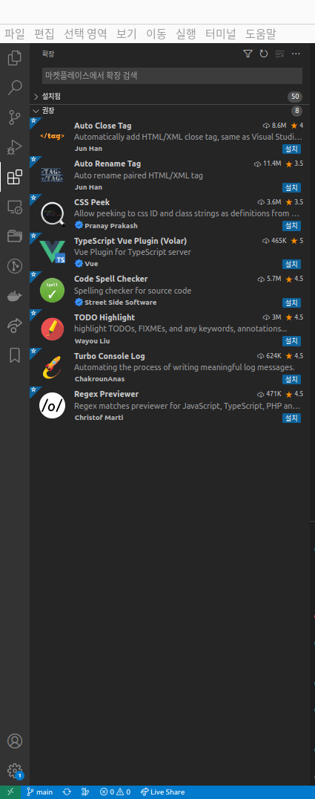

개발환경을 통일하기 위해 vscode-extension 을 적극 활용한다.

에디터를 통해 코드 컨벤션을 통일할 수 있도록 한다.

---

## VS Code Extension 제안

dev-front 프로젝트 루트(/) 경로에 `extensions.json` 파일이 작성되어 있다.

```json
{
  "recommendations": [
    "Vue.volar",
    "donjayamanne.githistory",
    "codezombiech.gitignore",
    "xabikos.JavaScriptSnippets",
    "sdras.vue-vscode-snippets",
    "hollowtree.vue-snippets",
    "rvest.vs-code-prettier-eslint",
    "esbenp.prettier-vscode",
    "christian-kohler.npm-intellisense",
    "formulahendry.auto-close-tag",
    "formulahendry.auto-rename-tag",
    "pranaygp.vscode-css-peek",
    "Vue.vscode-typescript-vue-plugin",
    "streetsidesoftware.code-spell-checker",
    "wayou.vscode-todo-highlight",
    "ChakrounAnas.turbo-console-log",
    "chrmarti.regex"
  ]
```

## 제안된 Extension 설치

vsocde 를 실행하여 `확장 프로그램 설치` 하는 메뉴를 클릭하면 권장이 나온다.

권장하는 Extension 을 사용하면 된다.

각 Extension 마다 설정하는 방법이 있을 수 있는데, Google 을 통해 찾아보면 된다.


